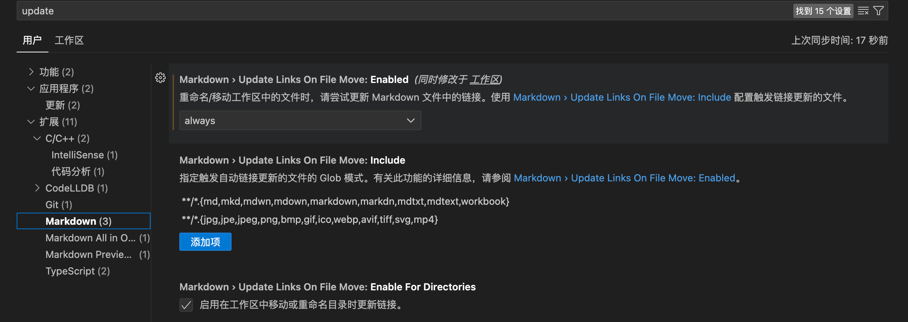

# Markdown的引用路径自动更新

## vscode
vscode中，markdown memo这个插件 (应该是下了all in one或者mpe就自带了) 里面的一些设置好像是管的

比较重要的是在用户设置里直接搜索update

  
选择always，这样以后重命名文件或者移动文件夹，引用路径就会自动更新了
爽！
这样就用本地相对引用就舒服多了

ps：但是改md文档的文件名并不会引起img文件夹里对映文件夹名字的改动，不过这个是小问题，自己改一下就好了
/img/{filename}这个是在**paste image**插件里设置的，可以自己改

## obsidian
ob里面貌似默认就是可以的