 # CS106L: Lec01 Streams1

---
实际上Streams库是C++中比较老的库了，但从Streams开始是有必要的，因为当你一开始学习C++，你的第一个项目很可能是一个HelloWorld程序，你很可能希望使用输入和输出流。
这节课会介绍一些流的细节

---


## 使用流的原因
我们使用流的其中一个原因就是我们希望我们的程序能与外部的设备进行交互：当我们编写程序时，不是所有我们想使用的信息都包含在程序代码内的（self-contained）。
图里是我们经常会用到的一些外部设备：
<div align=center>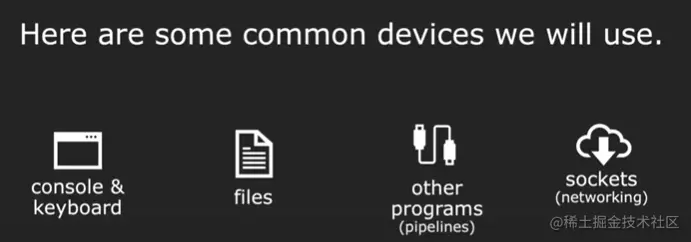</div>  

控制台、键盘、文件这里不赘述。
这里提一下other programs：程序/进程之间传输数据，比如常用的IPC方式就是管道pipelines（注：pipelines实现的方式之一就是输入输出重定向）

网络中会用到sockets

比如说我们想要读取一个文件中的浮点数3.14，我们需要先读取这个浮点数信息的字符串表示："3.14"，再将其转换成浮点数3.14

<div align=center>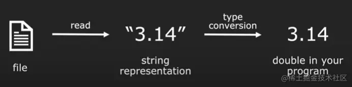</div>  

还有字符串到对象/结构体的转换：
<div align=center>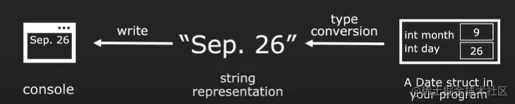</div>  
这里的关键点就是你在把一些变量、数据结构传输到控制台前，需要将其转换为字符串
有两个难点：

1. 如何从外部源中以字符串的形式读取数据
<div align=center>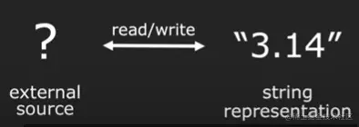</div>  

2. 如何把字符串再转换成我们需要的类型
<div align=center>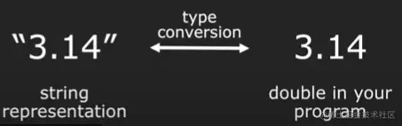</div>  

stream库做的事情就是把第一个问题进行了封装，你使用流的时候不需要考虑是怎么从外部读进来的，可以把stream看成一个buffer，它会自动从外部读取数据，你只需要关注如何把字符串转换成你需要的类型就好了
<div align=center>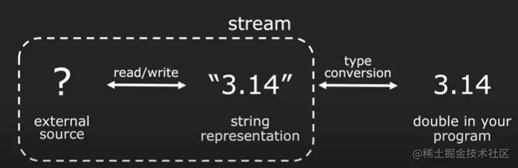</div>  
cout的时候，不需要考虑如何与console交互

## Stream的分类
每种流都是有一个输入流一个输出流的
<div align=center>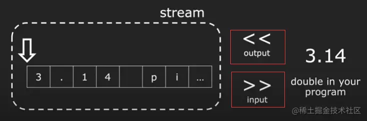</div>  

输出流：向buffer中插入数据 `stream <<`
输入流：从buffer中提取数据 `stream >>`

## stringstream
A stringstream is **not** connected to any external source.
<div align=center>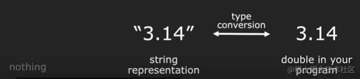</div>  

这是件好事，因为我们可以只专注于类型转换是如何做的

### ostringstream
ostringstream: output string stream,输出流是你将信息写入输出流/你可以发送数据给输出流。 当我们构建一个`ostringstream`时，我们可以给他一个字符串用于**初始化**。

```cpp
#include <sstream> // stringstream
#include <iostream> // cin cout

using namespace std;

int main(){
    ostringstream oss("Ito En Green Tea");
    cout << oss.str() << endl;
}

```
常用的方法是`str()`，这个方法会获取oss中的整个数组然后将其转换成字符串
<div align=center>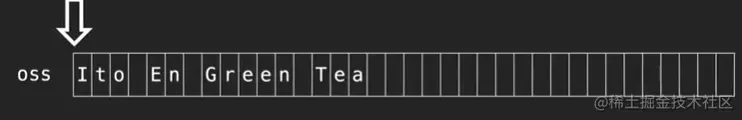</div>  

- 编译指令
```bash
g++ -std=c++17 -Wall ostringstream.cpp -o oss
```

`-Wall`是打开警告(Warn all，但实际上不是全部警告，可以再加上`-Wextra`等)，`-o`是给可执行文件一个指定的名字。
我们也可以向ostringstream中写入信息，这就是为什么他叫output字符串流。

```cpp
ostringstream oss("Ito En Green Tea");
cout << oss.str() << endl;
oss << 16.9 << " Ounce";
cout << oss.str() << endl;
//(注意这里的" Ounce"并不是string类的对象，它实际上是一个C string)
```
<div align=center>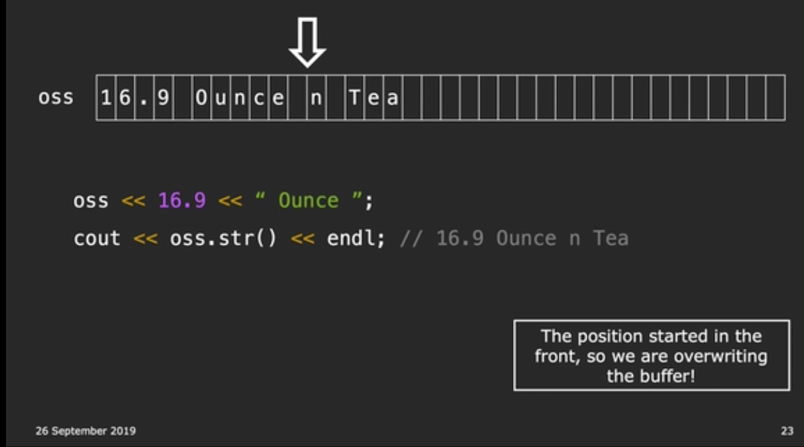</div>  

- 原因解释：
创建一个ostringstream的时候，指针从**起始位置**开始移动，会覆盖掉之前初始化的内容
如果继续往里面写入东西，指针就从当前位置开始往后
<div align=center>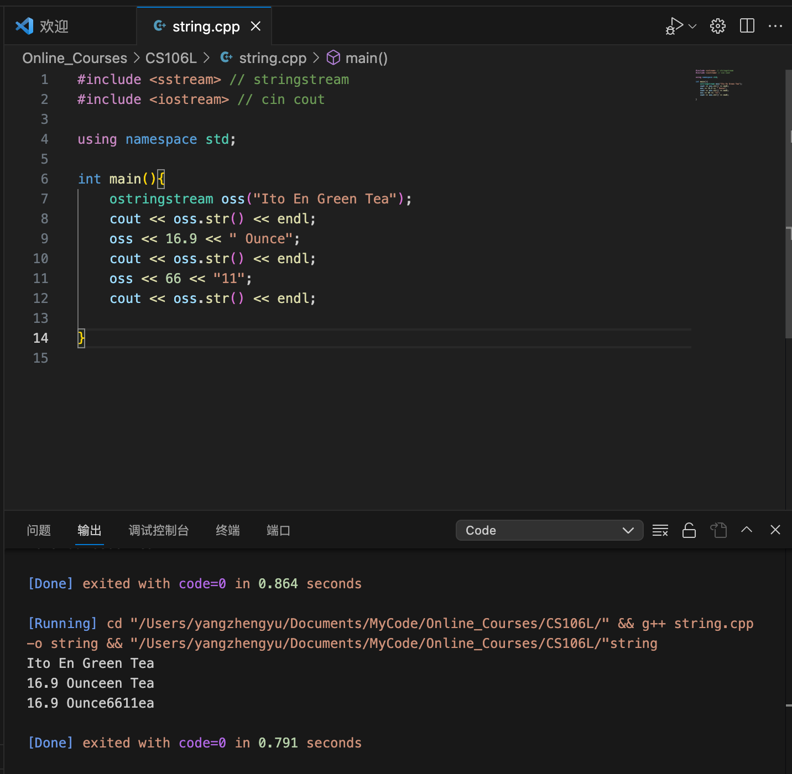</div>  

<div align=center>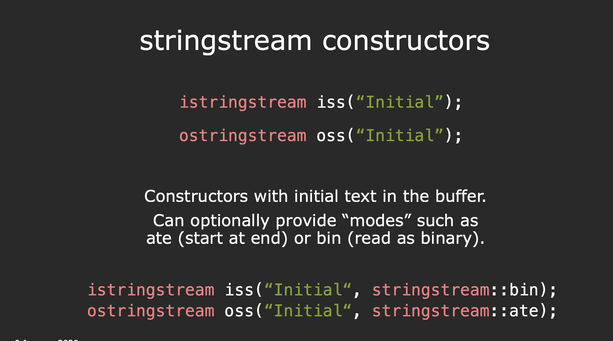</div>  

如果你希望在打开一个流时指针不是在起始位置，而是指定指针的偏移，你可以在创建流时构造函数内添加额外的参数：

`ostringstream oss("Ito En Green Tea",ostringstream::ate)`: `ate`指at end，流打开时就会指向最后面，此时的输出为：
（注：另一个常见的参数是：`stringstream::binary`，表示字符串流为二进制模式）
<div align=center>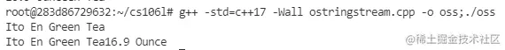</div>  

- 继续写
```cpp
oss<< "(pack of " << 12 << ")\n"; //是不是很像c
```
<div align=center>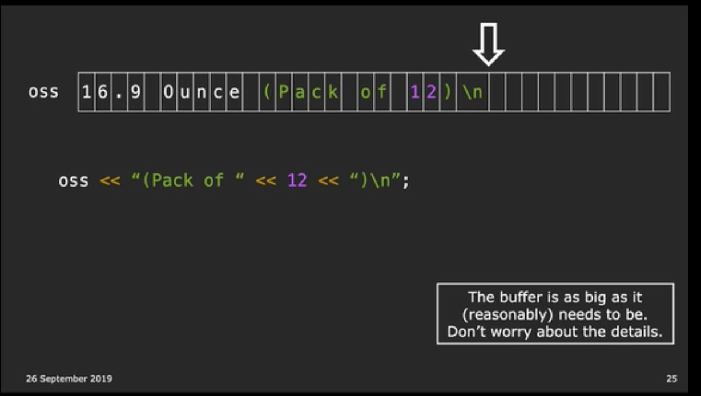</div>  


### Standard iostreams

- `cin`: Standard input stream(buffered)
- `cout`: Standard output stream(buffered)
- `cerr`: Standard error stream(unbuffered)
- `clog`: Standard error stream(buffered)

#### Output Streams

`std::out` is an output stream. It has type `std::ostream`.

- Can only send data using the `<<` operator.
- Converts data of any type into **string** and sends it to the stream.
- std::cout is the output stream that goes to the **console.**

```cpp
std::cout << 5 << std::endl;
// converts int value 5 to string "5"
// send "5" to the console output stream
```


#### Input Streams
`std::cin` is an input stream. It has type `std::istream`.

- Can only send data using the `>>` operator.
- Receives a **string** from the stream and converts it to **data**.
- std::cin is the input stream that gets input from the **console**.
- The result of `cin >> ` expression is `bool`, we can use if (cin >> ...) to check input. 


```cpp
int x;
string str;
std::cin >> x >> str;
//reads exactly one int then one string from console
```


about **std::in**

- Each `>>` only reads until the next **whitespace(tab, space, newline)**.
- Everything after the first whitespace **gets saved(saved in buffer)** and used the next time `std::cin >>` is called.
- Once an error is detected, the input stream's **fail bit** is set, and it will no longer accept input.
- **Types matter**
	- **Stream stops reading at any whitespace or any invalid character for the type.**


**Why >> with cin is a nightmare?**
- cin reads the **entire line into the buffer** but extracts whitespace-separated tokens.
- Trash in the buffer will make cin not prompt the user for input at the right time.
- When cin fails, all future cin calls fail too.


**Think of a std::istream as a sequence of characters**


```cpp
int age; double hourlyWage;
cout << "Please enter your age: ";
cin >> age;
cout << "Please enter your hourly wage: ";
cin >> hourlyWage;
//what happens if first input is 2.17?

cout << "\nage: " << age << endl;
cout << "hourlyWage : " << hourlyWage << endl;
// age: 2
// hourlyWage: 0.17
```


When we first input 2.17, the `2` is read and put into variable `age`, but the std::istream is still reading(not meet whitespace), and save `.17` in buffer, when the second `std::cin >>` called, write `.17` into variable `hourlyWage`. 

### State bits

We can use state bits to check if the stream has errors.

- `Good bit`: ready for read/write
- `Fail bit`: previous operation failed, all future operations frozen
	- type mismatch
	- file can't be opened
	- seekg failed
- `EOF bit`: previous operation reached the end of buffer content
- `Bad bit`: external error, likely irrecoverable


```cpp
std::istringstream iss(str);
cout << iss.good() << endl;
cout << iss.fail() << endl;
cout << iss.eof() << endl;
cout << iss.bad() << endl;
```


### std::getline()

- Defined in header `<string>`
- Used to read a string or a line from an **input stream**.
- Signature: `istream& getline(istream& is, string& str, char delim);`
	- **is:** Stream to read from
	- **str:** Place where input from stream is stored
	- **delim:** When to stop reading (`\n` as default)
-  How it works
	- Clears contents in **str**
	- Extracts chars from **is** and stores them in **str** until:
		- End of file buffer of **is,** sets **EOF bit** (can be checked using `is.eof()`)
		- Next char in **is** is **delim(default is \\n)**, extracts but does **not store delim**
		- **str** max size is reached, sets **FAIL bit** (can be checked using `is.fail()`)


Notice getline(istream& stream, string& line) takes in both parameters by **reference**!


How to use std::getline()


```cpp
string line;
std::getline(cin, line); // now line has changed
std::cout << line << std::endl;
```


Compare `>>` with `geline`:

- `>>` reads up to the next whitespace character and **does not go past that whitespace character.**
- `getline` reads up to the next delimiter (by default, '\n'), and **does go past that delimiter.**

### File Streams

#### Output File Streams

- Defined in header `<fstream>`
- Have type `std::ofstream`
- Can only send data using the `<<` operator.
- Converts data of any type into a **string** and sends it to the **file stream**.
- Must initialize your own **ofstream object linked to your file**.


```cpp
std::ofstream out_file("out.txt"); 
// out_file is now an ofstream that outputs to out.txt
out_file << 5 << std::endl; // out.txt now contains 5
```


#### Input File Streams

- Defined in header `<fstream>`
- Have type `std::ifstream`.
- Only receives strings using the `>>` operator.
- Receives **strings from a file** and converts it to data of any type.
- Must initialize your own **ifstream object** linked to your file.


```cpp
std::ifstream in_file("out.txt");
// in_file is now an ifstream that reads from out.txt string str;

string str;
in_file >> str; // first word in out.txt goes into str
```



#### File mode

- `ios::app`: append
- `ios::ate`: at end
- `ios::in`: open file for reading
- `ios::out`: open file for writing
- `ios::trunc`: truncate, if the file exists, empty the file contents when open the file
- multi mode
	- we can use `|` to combine two modes, like **ios::out | ios::ate**

### String Streams

- Input stream: `std::istringstream`
	- Give any data type to the **istringstream,** it’ll store it as a string. 
	 **(data type -> string)**
 - Output stream: `std::ostringstream`
	 - Make an **ostringstream** out of a **string,** read from it word/type by word/type. 
	  **(string -> data type)**


```cpp
// ostringstream
std::ostringstream oss("Hello world");
cout << oss.str() << endl;
// Hello world
oss << "Game over";
cout << oss.str() << endl;
// Game overld

// Q: why?
// A: The buffer doesn't refresh.

// istringstream
Student reverseJudgementCall(string judgement) {
  // input: “Sarah age 21, rocks”
  std::istringstream converter(judgement);
  string fluff;
  int age;
  bool lovesCpp;
  string name;
  converter >> name; // Sarah
  converter.ignore() // pass over a character -> age
  converter >> age; // 21
  converter >> fluff; // ,
  string cool; 
  converter >> cool; // rocks
  if (cool == "rocks")
    return Student{name, age, "bliss"};
  else
    return Student{name, age, "misery"};
}
```


<div align=center>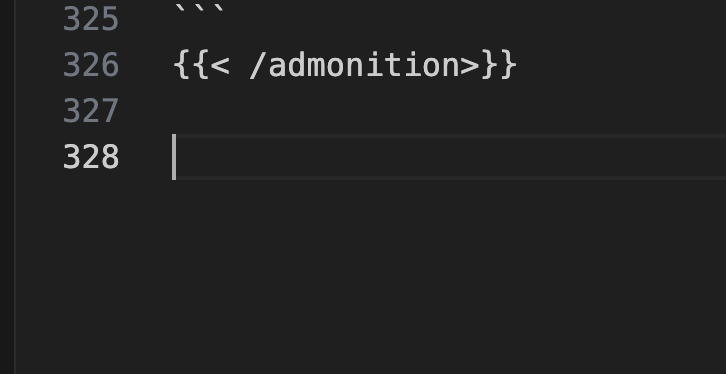</div>  