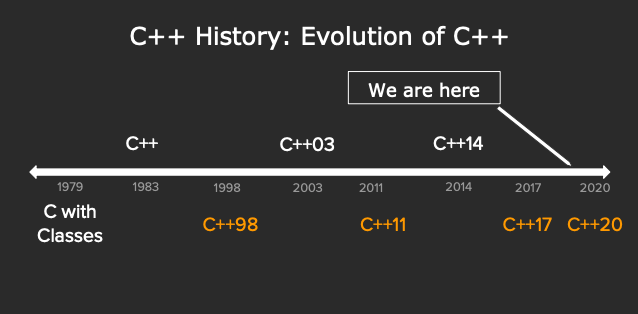

# CS106L: Lec00 Welcome

<!--more-->

<meta name="referrer" content="no-referrer" />

# About CS106L

- Focus is on **code:** What makes it good, what powerful and elegant code looks like
- The real deal: No Stanford libraries, only STL
- Understand how and why C++ was made

# C++ History

## Assembly

Benefits

- Unbelievably **simple** instructions
- Extremely **fast** (when well-written)
- **Complete control** over your program

Drawbacks

- A lot of code to do simple tasks
- Very hard to understand
- Extremely unportable (hard to make work across all systems)

Writing assembly was too difficult but computers only
understood assembly.

  

## Invention of C

C made it easy to write code that was

- Fast
- Simple
- Cross-platform

Weakness

- **No objects or classes**
- Difficult to write **generic code**
- **Tedious**冗长 when writing large programs

  

## Design Philosophy of C++

[Cpp Core Guidelines](https://isocpp.github.io/CppCoreGuidelines/CppCoreGuidelines)

- **Only add features if they solve an actual problem**
- Express ideas and intent directly in code
- **Compartmentalization(区块化)** is key
- Do not waste time or space
- **Enforce safety at compile time whenever possible**


C++: Basic Syntax + the STL

Standard C++: Basic Syntax + std(standard) library


## The STL

- Tons at of EOL general functionality
- Built in classes like maps, sets, vectors
- Accessed through the namespace std::
- **Extremely powerful and wel-maintained**

