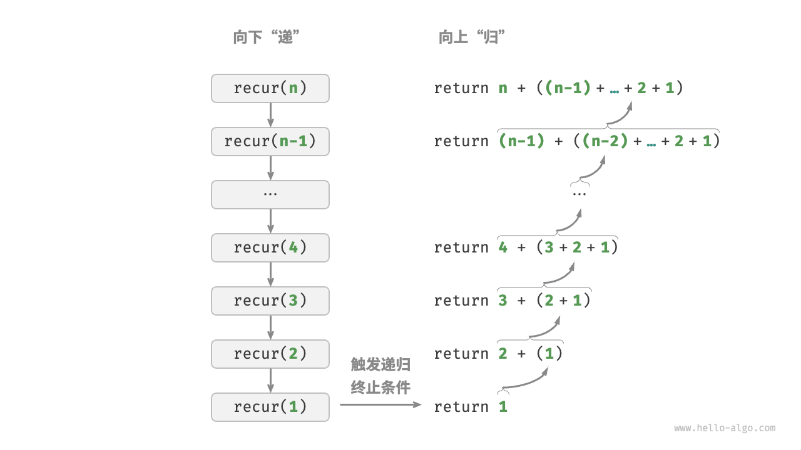
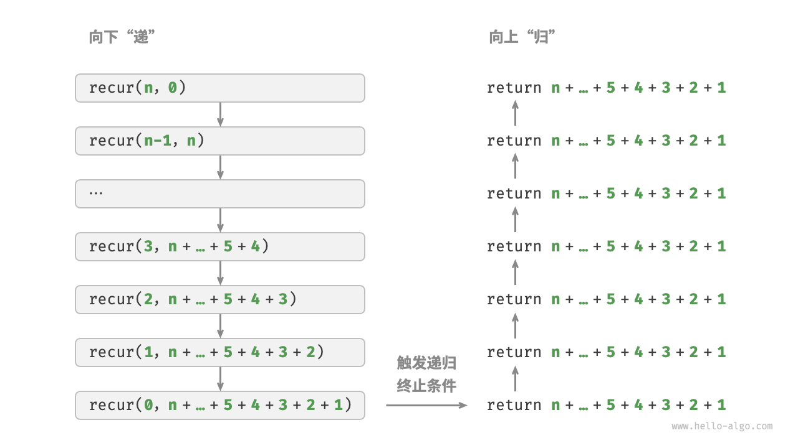

# 算法分析

一个**算法(algorithm)** 是为了实现特定任务的一个有限条指令的集合

算法满足这些性质： 

* Input
* Output
* Definiteness
* Finiteness
* Effectiveness

**Note:** program 可以不 finite(***e.g.*** 操作系统)

## 分析内容

* 运行时间：与机器、编译器有关
* 时间 & 空间复杂度：与机器、编译器无关

假设：

* 指令按顺序执行
* 每条指令是简单的，只需要一个时间单位执行
* 数据规模是给定的，而空间是无限的

通常我们需要分析 $T_{avg}(N) \& T_{worst}(N)$, $N$ 是输入规模（可以有多个输入）

## 渐进符号

### 定义

> 大 $O$ 表示法 $T(N) = O(f(N))$，如果存在常数 $c$ 和 $n_0$​使得当 $N\geq n_0$ 时 $T(N)\leq c\cdot f(N)$  
渐进上界，即 $T(N)$ 的阶不会高于 $f(N)$（增长比 $f(N)$ 慢或相同，$\leq$）

> 大 $\Omega$ 表示法 $T(N) = \Omega(g(N))$，如果存在常数 $c$ 和 $n_0$​使得当 $N\geq n_0$ 时 $T(N)\geq c\cdot f(N)$  
渐进下界，即 $T(N)$ 的阶不会低于 $f(N)$（增长比 $f(N)$ 快或相同，$\geq$）

> 大 $\Theta$ 表示法 $T(N) = \Theta(h(N))$，当且仅当 $T(N) = O(h(N))$ 且 $T(N) = \Omega(h(N))$  
渐进紧确界，即 $T(N)$ 与 $h(N)$ 同阶（增长速度相同，$=$)

> 小 $o$ 表示法 $T(N) = o(p(N))$，当 $T(N)=O(p(N))$ 且 $T(N)\neq \Theta(p(N))$ 时成立
非渐进紧确上界，（即 $T(N)$ 增长比 $p(N)$慢，$<$）

> 小 $w$ 表示法 $T(N) = w(p(N))$，当 $T(N)=\Omega(p(N))$ 且 $T(N)\neq \Theta(p(N))$ 时成立
非渐进紧确下界，（即 $T(N)$ 增长比 $p(N)$快，$>$）

### 运算规则

* 若 $T_1(N)=O(f(N)), T_2(N)=O(g(N))$  
    * $T_1(N)+T_2(N)=\max(O(f(N)), O(g(N))$
    * $T_1(N)\cdot T_2(N)=O(f(N)\cdot g(N))$
* 若 $T(N)$ 是最高次数为 k 次的多项式，那么 $T(N)=\Theta ((N^k))$  
* 对于任意常数 $k$, 都有 $\log^kN=O(N)$，这说明对增长非常缓慢。
* 分析时的规则
    * for loop  
    运行时间是循环内部语句的最长时间（包括 for 边界判断）乘循环的次数
    * 嵌套 for loop  
    运行时间是各个 for loop 的运行时间逐次相乘
    * 连续执行的语句  
    相加
    * if else  
    运行时间不会超过判断时间加上用时最多的语句块的时间


## 递归
「递归 recursion」是一种算法策略，通过函数调用自身来解决问题。它主要包含两个阶段。

1. 递：程序不断深入地调用自身，通常传入更小或更简化的参数，直到达到“终止条件”。
2. 归：触发“终止条件”后，程序从最深层的递归函数开始逐层返回，汇聚每一层的结果。
而从实现的角度看，递归代码主要包含三个要素。

1. 终止条件：用于决定什么时候由“递”转“归”。
2. 递归调用：对应“递”，函数调用自身，通常输入更小或更简化的参数。
3. 返回结果：对应“归”，将当前递归层级的结果返回至上一层。

```c
/* 递归 */
int recur(int n) {
    // 终止条件
    if (n == 1)
        return 1;
    // 递：递归调用
    int res = recur(n - 1);
    // 归：返回结果
    return n + res;
}
```
<div align=center></div>

虽然从计算角度看，迭代与递归可以得到相同的结果，但它们代表了两种完全不同的思考和解决问题的范式。

- 迭代：“自下而上”地解决问题。从最基础的步骤开始，然后不断重复或累加这些步骤，直到任务完成。
- 递归：“自上而下”地解决问题。将原问题分解为更小的子问题，这些子问题和原问题具有相同的形式。接下来将子问题继续分解为更小的子问题，直到基本情况时停止（基本情况的解是已知的）。

递归函数每次调用自身时，系统都会为新开启的函数分配内存，以存储局部变量、调用地址和其他信息等。这将导致两方面的结果。

- 函数的上下文数据都存储在称为“栈帧空间”的内存区域中，直至函数返回后才会被释放。因此，递归通常比迭代更加耗费内存空间。

- 递归调用函数会产生额外的开销。因此递归通常比循环的时间效率更低。

**递归深度**

尾递归
有趣的是，如果函数在返回前的最后一步才进行递归调用，则该函数可以被编译器或解释器优化，使其在空间效率上与迭代相当。这种情况被称为「尾递归 tail recursion」。

- 普通递归：当函数返回到上一层级的函数后，需要继续执行代码，因此系统需要保存上一层调用的上下文。
- 尾递归：递归调用是函数返回前的最后一个操作，这意味着函数返回到上一层级后，无须继续执行其他操作，因此系统无须保存上一层函数的上下文。


```c 
/* 尾递归 */
int tailRecur(int n, int res) {
    // 终止条件
    if (n == 0)
        return res;
    // 尾递归调用
    return tailRecur(n - 1, res + n);
}
```

- 普通递归：求和操作是在**归**的过程中执行的，每层返回后都要再执行一次求和操作。
- 尾递归：求和操作是在**递**的过程中执行的，“归”的过程只需层层返回。

<div align=center></div>


那么，迭代和递归具有什么内在联系呢？以上述递归函数为例，求和操作在递归的“归”阶段进行。这意味着最初被调用的函数实际上是最后完成其求和操作的，这种工作机制与栈的“先入后出”原则异曲同工。

事实上，“调用栈”和“栈帧空间”这类递归术语已经暗示了递归与栈之间的密切关系。

1. 递：当函数被调用时，系统会在“调用栈”上为该函数分配新的栈帧，用于存储函数的局部变量、参数、返回地址等数据。
2. 归：当函数完成执行并返回时，对应的栈帧会被从“调用栈”上移除，恢复之前函数的执行环境。